# Database Security Workshop: Advanced Security - Transparent Data Encryption

## Introduction

This is the first of several labs which are part of **Oracle Database Security Workshop.** This workshop will walk you through the process configuring, validating and using all of Oracle's Database Securtity products

Oracle Advanced Security comprises two security features to protect sensitive database data. The first feature is Transparent Data Encryption (TDE) which encrypts data "at rest." Encryption is done using a key that must be available to a database that either reads or writes encrypted data. The encryption is performed inside the data files that store the Oracle Database data. It remains encrypted until it is retrieved from disk for use in an application. This is true for any other use of the data files—exporting tables, backing up data files, and so on—the data included in the export file or on backup disks or tapes will remain encrypted until used in a database with a matching encryption key.

***To log issues***, click here to go to the [github oracle](https://github.com/oracle/learning-library/issues/new) repository issue submission form.

## Required Artifacts

- The following lab requires:
  - Laptop (Windows, Mac or Linux)
    - If running  Windows: [Putty and PuttyGen](https://www.chiark.greenend.org.uk/~sgtatham/putty/latest.html)
  - VNC client
  - Oracle 18c Database
  - Enterprise Manager 13c

## Encrypting your data

### **STEP 1**: Getting the environment ready

- On the Oracle Linux Desktop, navigate to the Database_Security_Labs folder, double-click and open the contents. 

    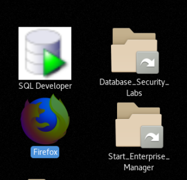

- Select the folder, Oracle_Advanced_Security.

  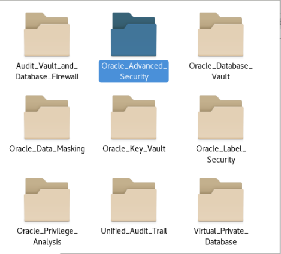

- Select the folder, OAS_-_Getting_The_Environment_Ready.

  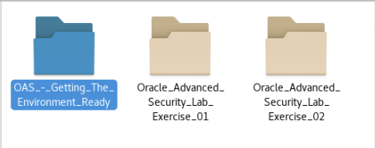

- In the OAS_-_Getting_The_Environment_Ready folder, select Start_Infrastructure.sh.  This script will start the entire necessary infrastructure used in these lab exercises. In these lab exercises, use the Display button to view the contents of the scripts before executing.  This will allow you to review the steps, commands and scripts used in these exercises.  When executing scripts, use the Run in Terminal button.

  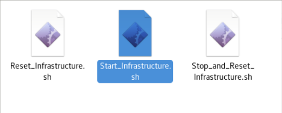

  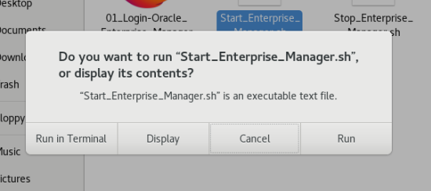

- Please be patient as the infrastructure may take a little time to start.  Once the infrastructure has started, you are ready to move forward with the exercises.

### **STEP 2**: ENCRYPTING A TABLESPACE

#### Overview

In this lab exercise, you will accomplish the following:
- Validate the status of the encryption keys using Oracle Enterprise Manager  Cloud Control
- OFFLINE the EMPLOYEESEARCH_DATA tablespace
- Migrate the tablespace to an encrypted tablespace 
- Verify that encryption has taken place

- After the Start_OAS_Infrastructure.sh script finishes (see the steps at the end of the section B), open the Labs folder on the Oracle Linux Desktop, and navigate to the Oracle_Advanced_Security folder.

  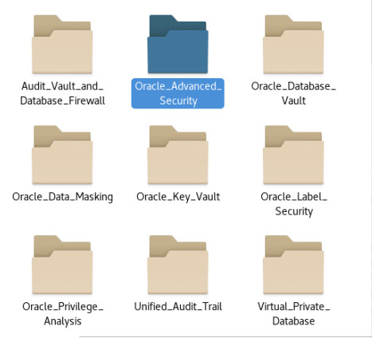

- Open Oracle_Advanced_Security_Lab_Exercise_01 folder.

  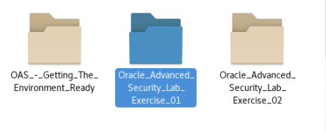

- Open the 01_Encrypt_Sensitive_Information browser shortcut.

  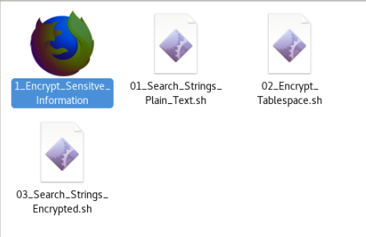

- Click the bookmark for Enterprise Manager.

  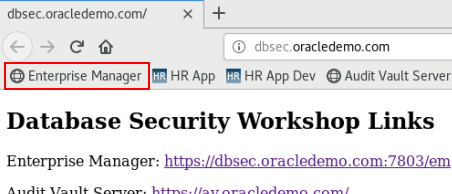

- Log in with the credentials SYSMAN/Oracle123 and navigate to the PDB Database home page by selecting the Databases menu item from the 'Targets' drop down menu as shown below.

  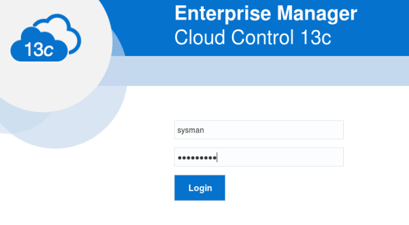

  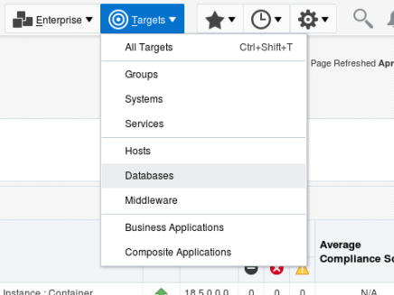

- Expand the tree structures and click the pluggable database 'cdb_PDB1' as shown.  There may be additional targets, but cdb_PDB1 will appear in the Pluggable Databases tree.

  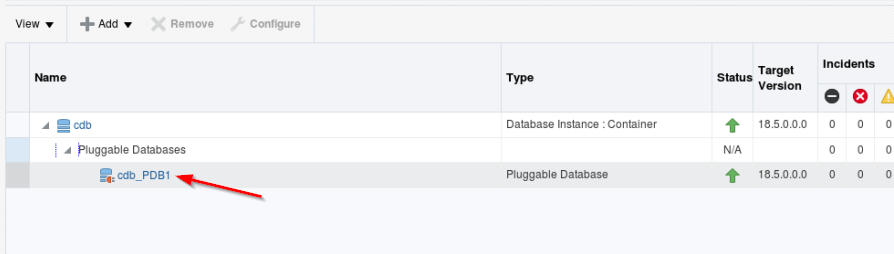

  This opens the PDB1 home page.  Review the status of your environment by selecting Security → Transparent Data Encryption. 

  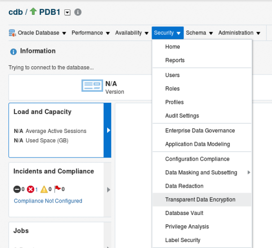

  If the Database Login page appears, then log in as an administrative user, such as SYS. User SYS must log in with the SYSDBA role selected.  For convenience, select from one of the saved Named Credentials for PDB1, then click Login.

  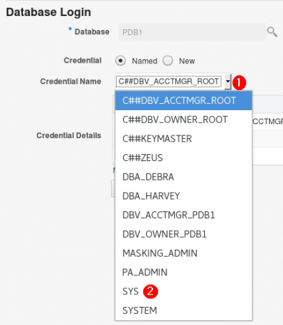

- Expand on the Keystore and Master Keys section in the lower left hand corner and review the information provided in the Oracle Advanced Security – Transparent Data Encryption screen.  Notice that the Keystore Status is OPEN and you have one Master Key in use—pdb1.   You can now encrypt data within the database. 

  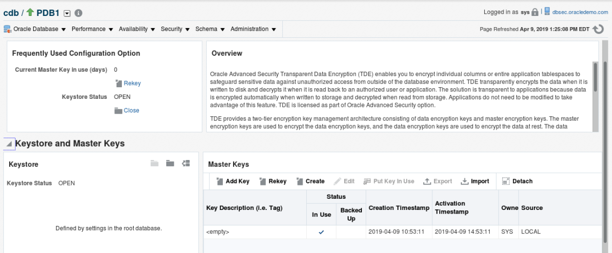

- Scroll down to Encrypted Objects and see what we have

  

- Within Encrypted Tablespaces, Click Offline Operations and choose Offline

  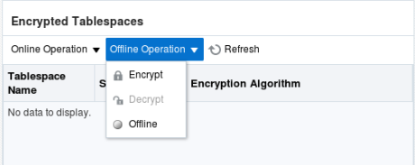

- Click the magnifying glass icon to search for a tablespace to put offline

  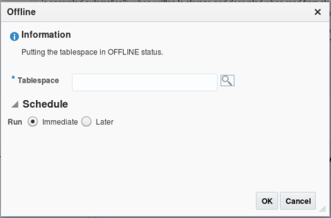

- Choose EMPLOYEESEARCH_DATA as the tablespace, and click OK

  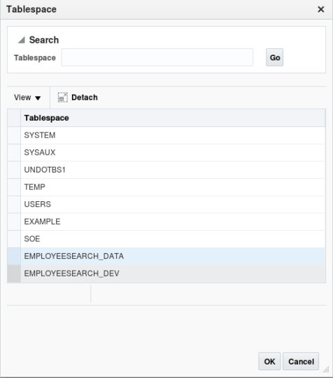

- Ensure Run Immediate is selected, then Click ok

  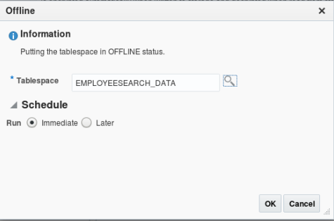

  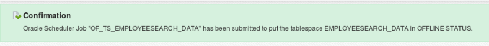

- Scroll back down to Encrypted Tablespaces, Click Offline Operation, and click Encrypt

  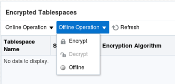

- Click the search icon 

  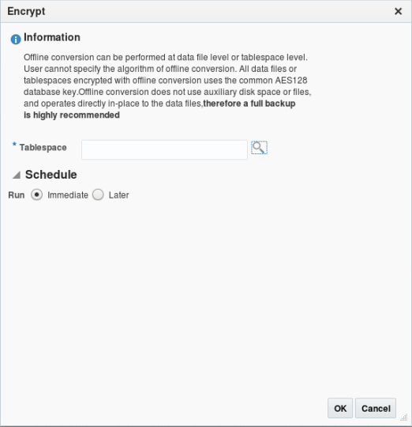 

- Choose EMPLOYEESEARCH_DATA as the offline tablespace to convert, click OK

  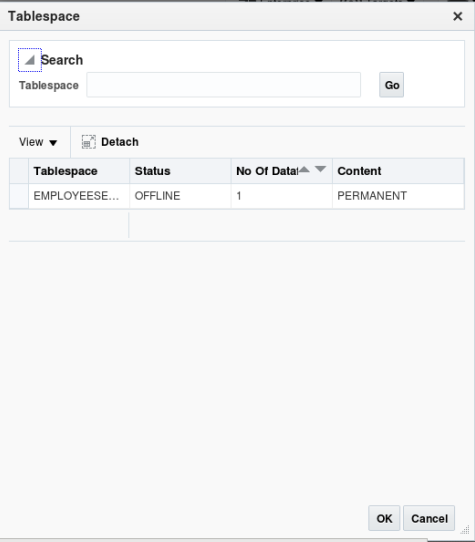

- Ensure Run Immediate is selected, then click ok

   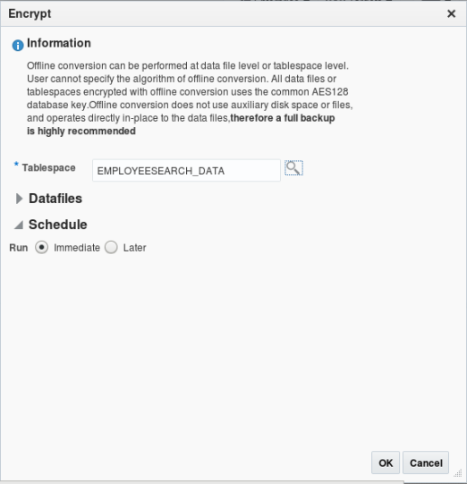 

   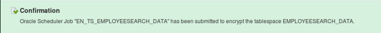

- Under Encrypted Objects, click Refresh on Encrypted Tablespaces. Within a few seconds you should see EMPLOYEESEARCH_DATA back ONLINE with AES128 encryption

  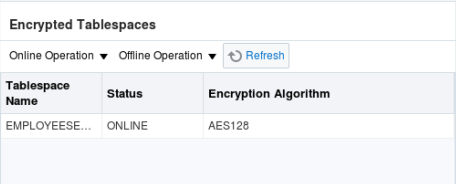

- Back in the Oracle_Advanced_Security desktop folder, click 03_Search_Strings_Encrypted.sh and verify that the data has been encrypted.  It will look similar to this screenshot

  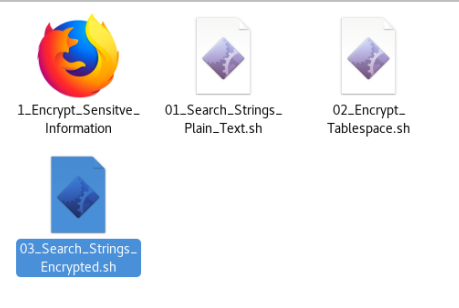

  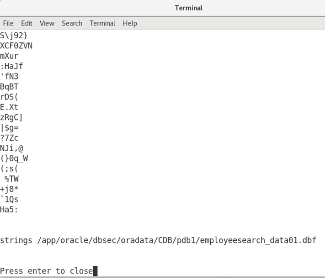

- Finally, return to the Security -> Transparent Data Encryption Section.

  Review in the Encrypted Objects section that the tablespace, EMPLOYEESEARCH_DATA is encrypted with the default Encryption Algorithm.

You have now demonstrated encryption of datafiles by the database, completely transparently to any application.  
For additional information, see also:
• "Checking Encrypted Tablespaces in the Current Database Instance" to query the database for existing encrypted tablespaces
http://docs.oracle.com/cd/E16655_01/server.121/e17609/tdpsg_encryption.htm#CHDECIDD
• Oracle Database Advanced Security Administrator's Guide for detailed information about tablespace encryption
http://docs.oracle.com/cd/E16655_01/network.121/e17729/toc.htm
• Oracle Database SQL Language Reference for more information about the CREATE TABLESPACE statement
http://docs.oracle.com/cd/E16655_01/server.121/e17209/statements_7003.htm#SQLRF01403

### **STEP 3**: PROTECTION OF SENSITIVE DATA IN APPLICATIONS USING ORACLE DATABASE DATA REDACTION 

Oracle Data Redaction enables you to move redaction capabilities out of applications and into the database. It provides an easy way to protect sensitive information that is displayed in applications by replacing it on-the-fly with valid redacted data, while keeping the applications running. Sensitive information is concealed according to flexible polices that provide conditional redaction and that are managed directly within the database. For maximum transparency, redaction preserves the type and formatting of column data returned to applications, and it does not alter the underlying database blocks on disk or in cache. Oracle Data Redaction is designed to be fast so that it can run on production systems. In addition, it is embedded in the database, so no separate installation is required.

Oracle Data Redaction enables you to mask (redact) data that is returned from queries issued by low-privileged users or applications. 

#### Overview

In this lab exercise, you will accomplish the following:
- Create simple redaction policy
- Use redaction templates to define policies for full/partial redaction
- Verify that redaction applies transparently across all applications

#### Setup and preparation

- On the Oracle Linux Desktop, navigate to the Database_Security_Labs folder. 

  

- Select the folder, Oracle_Advanced_Security.

 

- Select the folder, Oracle_Advanced_Security_Lab_Exercise_02.

  

  Note: Oracle Advanced Security Lab_Exercise_01 contains Transparent Data Encryption exercises, covered in the first section of this workbook.

  You are ready to move forward to the Data Redaction lab exercise.

#### Oracle Advanced Security: Redaction

- In the Lab_Exercise_02_Advanced_Security folder, double-click the icon HR Application - Production icon to launch Firefox.
 
  

- Click Login and use the following credentials: hradmin/Oracle123 and click Login button to continue.

  

- Click Search Employees and then click Search to return all of the rows

  

- Click on Adams, Cynthia, and view her HR details.  Notice you can see her full Social Security Number, Social Identification Number, or National Identifier, as well as Corporate Card information and Supplemental Data such as Last Insurance Claim, Routing Number, and Bonus Amount. 

  

- You could implement controls within each application that uses this HR data, but instead, you will create a Data Redaction policy enforced at the database layer to restrict the visibility and access to this information by ANY application

Open a new tab in your browser and select the Enterprise Manager Cloud Control shortcut to access the Enterprise Manager console to administer Data Redaction.   

 

Login to the Enterprise Manager – Cloud Control application using the following credentials sysman/Oracle123.

- In the Enterprise Manager Home screen, click the Targets menu.  Select the Databases sub-menu item.

  

- Drill down and select the Pluggable Database PDB1.

  

- Select the menu option Security then Data Redaction.

  

- You may be prompted for database login credentials.  Here you should connect using the Named Credential for SYS to connect to PDB1.

  

- You will be taken to the Data Redaction overview page where you can create a new Data Redaction policy.  Click the highlighted Create button. 

  

- In the Create Data Redaction Policy screen, click the magnifier glass icon to search for the EMPLOYEESEARCH schema.

  

- Choose DEMO_HR_EMPLOYEES as the table to Redact

  

- For the Policy Name field, enter REDACT_EMP_DATA. Review that the Policy Expression is ‘1=1’.  This Redaction Policy Expression defaults to 1=1 (TRUE), meaning to always redact.

 Now define the columns to be redacted.  Click the Add button. 

   

- In the Add column dialogue, choose the Column, NINO and set the Sensitive Column Type to NINO and Redaction Function (FULL) at their default values.  Click the OK button to continue.

  

- After adding the NINO column to the Data Redaction Policy, click the Add button to add SSN, SIN, and CORPORATE_CARD with the parameters you see below.  

  

- The previous step creates an output file – Open that file by double clicking it.

  

- Note that your redaction policy is enforced even when accessing the data directly through SQL*Plus
 Redaction policies are rarely enforced globally, however.  If data is being stored, someone needs to be able to see that data.  These policies are generally enforced based on job role, session information, or some other environmental condition.

   

 - Highlight the Policy REDACT_EMP_DATA and click Enable

   

 - Return to the MY HR Application Browser window and refresh the page.  You should now see data has been redacted.

   

 - You will notice that Supplemental Data has not been redacted.  That data exists in a different table called EMPLOYEESEARCH.DEMO_HR_SUPPLEMENTAL_DATA.  If you wish to redact it you can create a similar policy on the table.

   

 - Disable the policy before moving on. 

  

 #### Conclusion

 As data exposed in applications continues to rapidly expand, enterprises must have strong controls in place to protect data no matter what devices or applications are used. Oracle Database helps organizations keep their sensitive information safe in this increasingly complex environment by delivering preventive, detective and administrative controls that enforce data security in the database. Oracle Advanced Security with Oracle Database provides two critical preventive controls.

Transparent Data Encryption encrypts data at rest to stop database bypass attacks from accessing sensitive information in storage. Data Redaction reduces exposure of sensitive information in applications by redacting database query results on-the-fly, according to defined policies. Together these two controls form the foundation of a multi-layered, defense-in-depth approach, and further establish Oracle Database as the world’s most advanced database security solution.

**This completes this Lab!**
