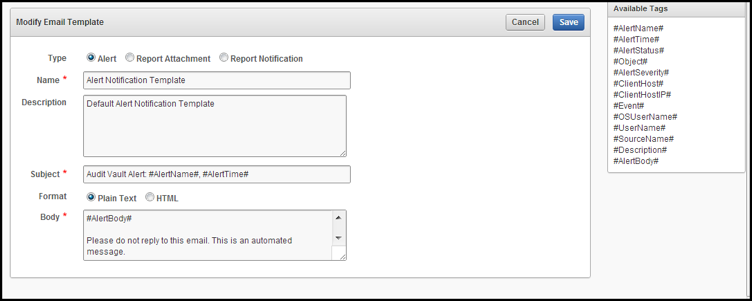

# Audit Vault and Database Firewall

## Lab 300: GAIN REAL-TIME DATABASE ACTIVITY MONITORING USING AUDIT VAULT AND DATABASE FIREWALL ALERTING 

#### Overview

Oracle Audit Vault and Database Firewall provides security personnel with the ability to detect and alert on activities that may indicate attempts to gain unauthorized access and/or abuse system privileges. Oracle Audit Vault can generate alerts for system defined and user defined audit events. Oracle Audit Vault continuously monitors the audit data collected, evaluating the activities against defined alert conditions. Alerts can be associated with any auditable database event including system events such as changes to application tables and creating privileged users. For instance, an alert could be generated when someone attempts to access sensitive business information. The Oracle Audit Vault interface provides graphical summaries of activities causing alerts. These include a summary of alert activity and top sources by number of alerts. Oracle Audit Vault users can click the summary graphs and drill down to a more detailed report. Alerts for the purpose of reporting are grouped by the sources with which they are associated. Alerts can also be grouped by the event category to which the event belongs, and by the severity level of the alert (warning or critical).

- You should have already completed Lab Configuration 02 – REDUCE TIME TO COMPLIANCE USING ORACLE AUDIT VAULT REPORTING before using this lab

- In this lab exercise, you will accomplish the following:
     - Modify the email template for Audit Vault Alerts
	- Add a new Audit Vault Alert Status
	- Create an Audit Vault Alert with the Web Interface
	- Test that the alert is functioning
	- View the near real-time nature of alert functionality
     
#### GAIN REAL-TIME DATABASE ACTIVITY MONITORING USING AUDIT VAULT ALERTING
    
- Open the **Audit – Lab Exercise 03** Folder

  

- Click the icon, **Step 01 – Create Alerts in Audit Vault UI** to open the browser.

- Log into the Audit Vault console as **avauditor/Oracle123+**.

  

- Navigate to the **Settings** tab:

  

- Select the **Notifications / Email Templates** page.  From here will be able to manage the existing template definitions and create new ones.  Once at this page you will see the following:

  

- Edit the **Alert Notification Template**, which is the default template for sending emails.  You could create a new template, but to simplify this lab, just edit the existing one.  Click the **Alert Notification Template** link on the left hand side of the page.

  

- Add the **#AlertStatus#** field into the email subject, as shown in the screen below.  Click the Save button once completed. 

  

  If the Database Login page appears, then log in as an administrative user, such as SYS. User SYS must log in with the SYSDBA role selected.  For convenience, select from one of the saved Named Credentials for PDB1, then click Login.

  

- Expand on the Keystore and Master Keys section in the lower left hand corner and review the information provided in the Oracle Advanced Security – Transparent Data Encryption screen.  Notice that the Keystore Status is OPEN and you have one Master Key in use—pdb1.   You can now encrypt data within the database. 

  

- Scroll down to Encrypted Objects and see what we have

  

- Within Encrypted Tablespaces, Click Offline Operations and choose Offline

  

- Click the magnifying glass icon to search for a tablespace to put offline

  

- Choose EMPLOYEESEARCH_DATA as the tablespace, and click OK

  

- Ensure Run Immediate is selected, then Click ok

  

  

- Scroll back down to Encrypted Tablespaces, Click Offline Operation, and click Encrypt

  

- Click the search icon 

   

- Choose EMPLOYEESEARCH_DATA as the offline tablespace to convert, click OK

  

- Ensure Run Immediate is selected, then click ok

    

   

- Under Encrypted Objects, click Refresh on Encrypted Tablespaces. Within a few seconds you should see EMPLOYEESEARCH_DATA back ONLINE with AES128 encryption

  

- Back in the Oracle_Advanced_Security desktop folder, click 03_Search_Strings_Encrypted.sh and verify that the data has been encrypted.  It will look similar to this screenshot

  

  

- Finally, return to the Security -> Transparent Data Encryption Section.

  Review in the Encrypted Objects section that the tablespace, EMPLOYEESEARCH_DATA is encrypted with the default Encryption Algorithm.

You have now demonstrated encryption of datafiles by the database, completely transparently to any application.  
For additional information, see also:
- "Checking Encrypted Tablespaces in the Current Database Instance" to query the database for existing encrypted tablespaces
http://docs.oracle.com/cd/E16655_01/server.121/e17609/tdpsg_encryption.htm#CHDECIDD
- Oracle Database Advanced Security Administrator's Guide for detailed information about tablespace encryption
http://docs.oracle.com/cd/E16655_01/network.121/e17729/toc.htm
- Oracle Database SQL Language Reference for more information about the CREATE TABLESPACE statement
http://docs.oracle.com/cd/E16655_01/server.121/e17209/statements_7003.htm#SQLRF01403

 #### Conclusion

 As data exposed in applications continues to rapidly expand, enterprises must have strong controls in place to protect data no matter what devices or applications are used. Oracle Database helps organizations keep their sensitive information safe in this increasingly complex environment by delivering preventive, detective and administrative controls that enforce data security in the database. Oracle Advanced Security with Oracle Database provides two critical preventive controls.

Transparent Data Encryption encrypts data at rest to stop database bypass attacks from accessing sensitive information in storage. Data Redaction reduces exposure of sensitive information in applications by redacting database query results on-the-fly, according to defined policies. Together these two controls form the foundation of a multi-layered, defense-in-depth approach, and further establish Oracle Database as the world’s most advanced database security solution.

**This completes the lab!**

- [Database Security Workshop Landing Page](https://github.com/kwazulu/dbsec-workshop/blob/master/README.md)
