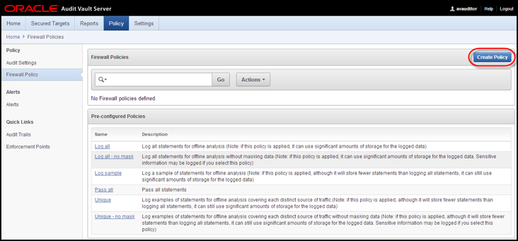

# Audit Vault and Database Firewall

## Lab 500: USE ORACLE DATABASE FIREWALL TO CONFIGURE POLICIES AND BLOCK UNAUTHORIZED TRAFFIC

#### White list, Black list, Exception list policies

Oracle Database Firewall examines the grammar of the SQL statements being sent to the database, analyzes their meaning, and determines the appropriate security policy to apply. This highly accurate approach provides a significantly higher degree of protection than first-generation database monitoring technologies that relied on recognizing the "signature" of known security threats. By enforcing normal application behavior, Oracle Database Firewall helps organizations avoid the costly and disruptive false positives and false negatives common with other approaches. Oracle Database Firewall recognizes SQL injection attacks on compromised applications and blocks them before they reach the database.

#### Iterative Policy Development Cycle 

Successful deployment of a Database Firewall depends on an effective policy. The Database Firewall policy editor enables you to design policies quickly and efficiently. Policy rules can depend on any combination of the SQL statement type, name of the database user, IP address of the database client, operating system user name, client program name, or any exceptions you specify.

Developing a policy is an iterative process that keeps refining and improving the policy with new data.

Developing a policy consists of these main steps:
1. Create a firewall policy in the Audit Vault Server. 
2. Design your policy by setting policy actions and rules. 
3. Publish the policy to make it available for applying to secured targets.
4. Assign the policy to selected secured targets.  


### Overview

- In this lab exercise, you will accomplish the following:
     - Complete an iterative development cycle of the baseline
     - Develop and deploy a Firewall policy
     - Modify and re-deploy the Firewall policy
     - Verify that policy is enforced and ensure that unseen traffic is blocked
### Setup and Preparation

- Completion of **LAB EXERCISE 01 – ORACLE DATABASE FIREWALL SECURED TARGETS TO MONITOR AND PROTECT DATABASES**

### Create and Test a Firewall Policy
 
The Oracle Database Firewall system must understand the normal way that client applications use the database. This is accomplished by logging traffic (such as via a test suite or by recording normal application traffic before you start developing a new Policy.  You have just been through that exercise with Swingbench.  Now you will move on to creating a Policy that will substitute an innocuous SQL statement in the place of any statement that the Firewall has not seen before.

- Begin by opening the folder labeled **FW – Lab Exercise 2**.  
    
  

- Click the icon **Step 1 – Create the Firewall Policy**.

  

- Log into the Audit Vault Server as **avauditor/Oracle123+**.

  

- Navigate to the Policy page and select **Policy / Firewall Policy**.  Then click the **Create Policy** button:

  

- In the screen that appears, fill in the appropriate information, and then click the **Create** button.

```
	Database Type:      Oracle Database
	Policy Name:        1 – Block Unseen Statements
	Description:        This will block any statements not previously seen by the Firewall.
```

  


  

  

- Expand the tree structures and click the pluggable database 'cdb_PDB1' as shown.  There may be additional targets, but cdb_PDB1 will appear in the Pluggable Databases tree.

  

  This opens the PDB1 home page.  Review the status of your environment by selecting Security → Transparent Data Encryption. 

  

  If the Database Login page appears, then log in as an administrative user, such as SYS. User SYS must log in with the SYSDBA role selected.  For convenience, select from one of the saved Named Credentials for PDB1, then click Login.

  

- Expand on the Keystore and Master Keys section in the lower left hand corner and review the information provided in the Oracle Advanced Security – Transparent Data Encryption screen.  Notice that the Keystore Status is OPEN and you have one Master Key in use—pdb1.   You can now encrypt data within the database. 

  

- Scroll down to Encrypted Objects and see what we have

  

- Within Encrypted Tablespaces, Click Offline Operations and choose Offline

  

- Click the magnifying glass icon to search for a tablespace to put offline

  

- Choose EMPLOYEESEARCH_DATA as the tablespace, and click OK

  

- Ensure Run Immediate is selected, then Click ok

  

  

- Scroll back down to Encrypted Tablespaces, Click Offline Operation, and click Encrypt

  

- Click the search icon 

   

- Choose EMPLOYEESEARCH_DATA as the offline tablespace to convert, click OK

  

- Ensure Run Immediate is selected, then click ok

    

   

- Under Encrypted Objects, click Refresh on Encrypted Tablespaces. Within a few seconds you should see EMPLOYEESEARCH_DATA back ONLINE with AES128 encryption

  

- Back in the Oracle_Advanced_Security desktop folder, click 03_Search_Strings_Encrypted.sh and verify that the data has been encrypted.  It will look similar to this screenshot

  

  

- Finally, return to the Security -> Transparent Data Encryption Section.

  Review in the Encrypted Objects section that the tablespace, EMPLOYEESEARCH_DATA is encrypted with the default Encryption Algorithm.


You have now demonstrated encryption of datafiles by the database, completely transparently to any application.  
For additional information, see also:
- "Checking Encrypted Tablespaces in the Current Database Instance" to query the database for existing encrypted tablespaces
http://docs.oracle.com/cd/E16655_01/server.121/e17609/tdpsg_encryption.htm#CHDECIDD
- Oracle Database Advanced Security Administrator's Guide for detailed information about tablespace encryption
http://docs.oracle.com/cd/E16655_01/network.121/e17729/toc.htm
- Oracle Database SQL Language Reference for more information about the CREATE TABLESPACE statement
http://docs.oracle.com/cd/E16655_01/server.121/e17209/statements_7003.htm#SQLRF01403


 #### Conclusion

 As data exposed in applications continues to rapidly expand, enterprises must have strong controls in place to protect data no matter what devices or applications are used. Oracle Database helps organizations keep their sensitive information safe in this increasingly complex environment by delivering preventive, detective and administrative controls that enforce data security in the database. Oracle Advanced Security with Oracle Database provides two critical preventive controls.

Transparent Data Encryption encrypts data at rest to stop database bypass attacks from accessing sensitive information in storage. Data Redaction reduces exposure of sensitive information in applications by redacting database query results on-the-fly, according to defined policies. Together these two controls form the foundation of a multi-layered, defense-in-depth approach, and further establish Oracle Database as the world’s most advanced database security solution.

**This completes the lab!**

- [Database Security Workshop Landing Page](https://github.com/kwazulu/dbsec-workshop/blob/master/README.md)
